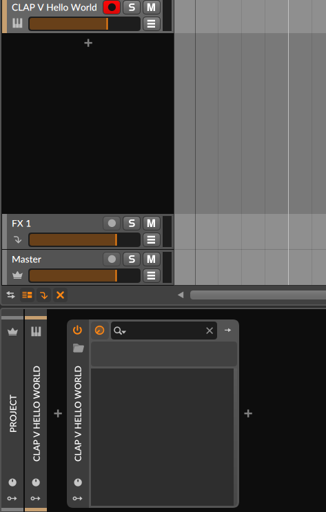

# vclap
Demonstration of a [CLAP](https://github.com/free-audio/clap) audio plugin in V.

Currently it does nothing besides being correctly built against official
CLAP headers and loading into a DAW without any errors.

**Note**: Only tested on Linux.

## Quickstart

Ensure you have a working [V language](https://vlang.io/) environment.

On top of that you'd need:

- GNU Make
- GCC

Start with:
```sh
git clone https://github.com/mo-foss/vclap.git
cd vclap
make
```

To confirm the plugin was built correctly you can use
[this tool](https://github.com/free-audio/clap-info/):
```sh
clap-info build/hello_world.clap
```

To test with your DAW, you have to make it discoverable:
```
make install
```

Here is the plugin being correctly loaded in Bitwig Studio 5.1:


